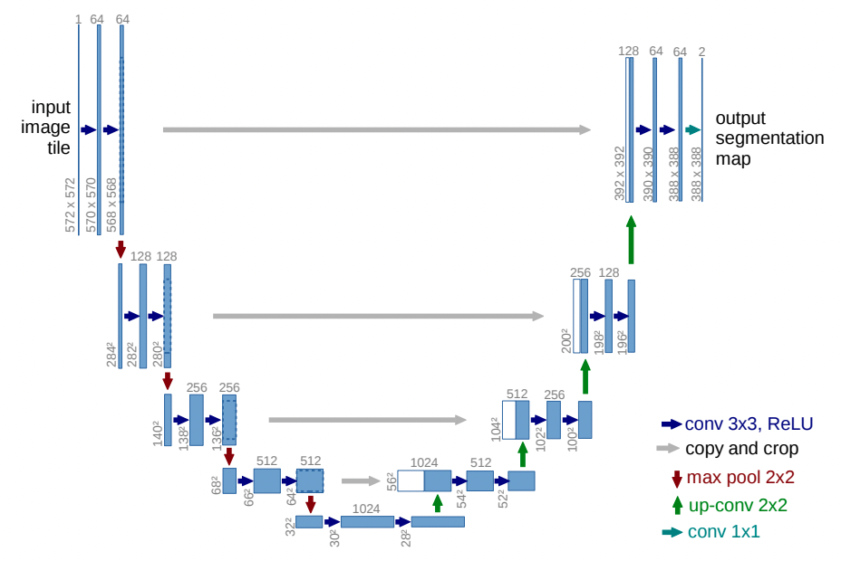

# PROJECT: LIVER SEGMENTATION OF MEDICAL CT IMAGES

(Full code is added in ircad.ipynb file)

<ul>
    <li>Automatically segment livers using the U-net architecture.</li>
    <li>Data source: <a href="https://www.dropbox.com/s/8h2avwtk8cfzl49/ircad-dataset.zip?dl=0">Data download URL</a></li>
    <li>Nibabel python library is used to load the NifTi (Neuroimaging Informatics Technology Initiative) data.</li>
    <li>The dataset consists of 20 medical examinations in 3D.</li>
    <li>Each original image has its corresponding binary mask.</li>
</ul>

The following diagram shows the overall U-net architecture.



Project Contents:

<ol>
    <li>DATA & SHAPE VISUALIZATION</li>
    <li>LOAD TRAIN & TEST DATA</li>
    <li>DATA AUGMENTATION & PRE-PROCESSING</li>
    <li>TRAINING A NEURAL NETWORK WITH KERAS</li>
    <li>TEST THE TRAINED NETWORK</li>
    <li>RESULTS & PLOTTING</li>
</ol>

# 1. DATA AND SHAPE VISUALIZATION:


```python
'''
train image and mask visualization.
slice 72 in the train image and mask has better/full view.
'''
train_mask = nibabel.load(f'{train_data_path}/ircad_e01_liver.nii.gz')
train_mask = train_mask.get_data()

train_image = nibabel.load(f'{train_data_path}/ircad_e01_orig.nii.gz')
train_image = train_image.get_data()

# pick a slice (72)
image = train_image[:, :, 72]
mask = train_mask[:, :, 72]

# plot an image, mask, and combined
plot_images([image], [mask])

```

    /var/folders/cg/h7_fl0497c7dyn_wxbcjdl4c0000gn/T/ipykernel_4244/544972443.py:6: DeprecationWarning: get_data() is deprecated in favor of get_fdata(), which has a more predictable return type. To obtain get_data() behavior going forward, use numpy.asanyarray(img.dataobj).
    
    * deprecated from version: 3.0
    * Will raise <class 'nibabel.deprecator.ExpiredDeprecationError'> as of version: 5.0
      train_mask = train_mask.get_data()
    /var/folders/cg/h7_fl0497c7dyn_wxbcjdl4c0000gn/T/ipykernel_4244/544972443.py:9: DeprecationWarning: get_data() is deprecated in favor of get_fdata(), which has a more predictable return type. To obtain get_data() behavior going forward, use numpy.asanyarray(img.dataobj).
    
    * deprecated from version: 3.0
    * Will raise <class 'nibabel.deprecator.ExpiredDeprecationError'> as of version: 5.0
      train_image = train_image.get_data()


    

    


# 2. LOAD TRAIN AND TEST DATA:


```python
def load_data(path, type_):
    '''
    load train and test data from nii.gz file.
    
    params:
    path: string
    type_: string
    
    return:
    images_np: ndarray
    masks_np: ndarray
    '''
    # load train and test data
    print(f'loading {type_} data...')
    
    # train/test images and corresponding masks
    images_np, masks_np = [], []

    # get list of train image names
    image_names = os.listdir(path)
    # get training mask image names
    image_masks = [x for x in image_names if 'liver' in x]

    for mask in tqdm(image_masks):
        # load mask nibabel image
        masks = nibabel.load(f'{path}/{mask}')
        # load original nibabel image
        image_name = mask.replace('liver', 'orig')
        images = nibabel.load(f'{path}/{image_name}')

        # get 3d mask and original image numpy array
        masks_3d = masks.get_data()
        images_3d = images.get_data()

        # traverse the 3d numpy array slice by slice
        for i in range(masks_3d.shape[2]):
            # get a 2d mask slice
            mask_2d = masks_3d[:, :, i]
            # if sum of the mask is >= 1, then we count it
            # otherwise ignore it
            if np.sum(mask_2d) >= 1:
                # store the 2d mask
                masks_np.append(mask_2d)

                # get the corresponding original image slice
                image_2d = images_3d[:, :, i]
                # store the 2d original image slice
                images_np.append(image_2d)

    print(f'total processed slices {len(images_np)}')
    
    # convert list to numpy array
    images_np = np.array(images_np)
    masks_np = np.array(masks_np)
    
    return images_np, masks_np


def preprocess_data(images):
    '''
    preprocess images.
    
    params:
    images: ndarray
    
    return:
    imgs_p: ndarray
    '''
    # preprocess train and test data for feeding to unet
    imgs_p = np.ndarray((images.shape[0], img_rows, img_cols), dtype=np.uint8)
    
    for i in tqdm(range(images.shape[0])):
        # resize and store to corresponding index
        imgs_p[i] = resize(images[i], (img_cols, img_rows), preserve_range=True)

    imgs_p = imgs_p[..., np.newaxis]
    
    print('preprocessing done.')
    
    return imgs_p

```


```python
# prepare train images and masks for training
imgs_train = preprocess_data(train_images_np)
imgs_mask_train = preprocess_data(train_masks_np)

imgs_train = imgs_train.astype('float32')
imgs_mask_train = imgs_mask_train.astype('float32')

# prepare test images and masks to use after training
imgs_test = preprocess_data(test_images_np)

imgs_test = imgs_test.astype('float32')

```

    preprocessing done.


```python
# show preprocessed train and test data shape
print(f'preprocessed train image shape {imgs_train.shape}')
print(f'downsampled train mask shape {imgs_mask_train.shape}')

print(f'preprocessed test image shape {imgs_test.shape}')

```

    preprocessed train image shape (1444, 256, 256, 1)
    downsampled train mask shape (1444, 256, 256, 1)
    preprocessed test image shape (630, 256, 256, 1)


# 3. DATA AUGMENTATION & PRE-PROCESSING:


```python
# get augmented images and masks
aug_images, aug_masks = augment_data(train_images_np, train_masks_np)
print(f'total augmented image slices {len(aug_images)}')

# combine augmented images and masks with the original images and masks
print('concatenating flipped images and masks with original images and masks...')
train_images_np = np.concatenate((train_images_np, aug_images), axis=0)
train_masks_np = np.concatenate((train_masks_np, aug_masks), axis=0)

print(f'total training image slices after augmentation {len(train_images_np)}')
```

    augmenting images and masks...


    100%|█████████████████████████████████████| 1444/1444 [00:01<00:00, 1300.98it/s]


    concatenating flipped images and masks...
    total augmented image slices 2888
    concatenating flipped images and masks with original images and masks...
    total training image slices after augmentation 4332


# 4. TRAINING A NEURAL NETWORK WITH KERAS:


```python
# set hyperparameters
BATCH_SIZE = 10
EPOCHS = 50
LEARNING_RATE = 1e-3
VALIDATION_SPLIT = 0.2
```


```python
'''
this block compiles and fits the model.
for each fold, it will perform the following operation.
weights file name: weights.h5
monitor: ['loss', 'accuracy', 'dice_coef']
'''
# kfold cross validation
# k = 5
kf = KFold(n_splits = 2, shuffle = False)

# compute mean for data centering
mean = np.mean(imgs_train)
# compute std for data normalization
std = np.std(imgs_train)

# normalize train data
imgs_train -= mean
imgs_train /= std

# save training history
histories = []
scores = []
itr = 0
for train_index, test_index in kf.split(imgs_train):
    itr += 1
    print(f'training for fold {itr}')
    
    X_train, X_test = imgs_train[train_index], imgs_train[test_index]
    y_train, y_test = imgs_mask_train[train_index], imgs_mask_train[test_index]
    
    # create and compile unet model
    print('compiling model...')
    model = build_unet_architecture()

    # save the weights and the loss of the best predictions
    model_checkpoint = ModelCheckpoint('weights.h5', monitor='val_loss', save_best_only=True)

    # fit model
    print('fitting model...')
    history = model.fit(X_train,
                        y_train,
                        batch_size=BATCH_SIZE,
                        epochs=EPOCHS,
                        verbose=1,
                        shuffle=True,
                        validation_split=VALIDATION_SPLIT,
                        callbacks=[model_checkpoint])
    
    histories.append(history)

```

    training for fold 1
    compiling model...
    fitting model...
    Epoch 1/50
    58/58 [==============================] - 42s 701ms/step - loss: 0.3608 - accuracy: 0.9682 - dice_coef: 0.6402 - val_loss: 0.3293 - val_accuracy: 0.9743 - val_dice_coef: 0.6491
    Epoch 2/50
    58/58 [==============================] - 38s 660ms/step - loss: 0.0958 - accuracy: 0.9892 - dice_coef: 0.9044 - val_loss: 0.4429 - val_accuracy: 0.9689 - val_dice_coef: 0.5385
    ...
    ...
    Epoch 50/50
    58/58 [==============================] - 42s 725ms/step - loss: 0.0123 - accuracy: 0.9986 - dice_coef: 0.9877 - val_loss: 0.1597 - val_accuracy: 0.9866 - val_dice_coef: 0.8198
    training for fold 2
    compiling model...
    fitting model...
    Epoch 1/50
    2021-12-21 18:58:48.446957: I tensorflow/core/grappler/optimizers/custom_graph_optimizer_registry.cc:112] Plugin optimizer for device_type GPU is enabled.
    58/58 [==============================] - ETA: 0s - loss: 0.4943 - accuracy: 0.8784 - dice_coef: 0.5075
    ...
    ...
    Epoch 50/50
    58/58 [==============================] - 42s 732ms/step - loss: 0.0172 - accuracy: 0.9980 - dice_coef: 0.9828 - val_loss: 0.7142 - val_accuracy: 0.9276 - val_dice_coef: 0.2763


# 5. TEST THE TRAINED NETWORK:


```python
'''
this block tests the trained classifier.
draw the predicted mask on the original test images.
store the images with drawn masks.
'''
# normalize test data
imgs_test -= mean
imgs_test /= std

# load saved weights
print('loading weights')
model.load_weights('weights.h5')

# predict masks on test data
print('predicting masks...')
imgs_mask_test = model.predict(imgs_test, verbose=1)

# save prediction
np.save('imgs_mask_test.npy', imgs_mask_test)
print('saving prediction...')
pred_dir = 'preds'

if not os.path.exists(pred_dir):
    os.mkdir(pred_dir)

for k in range(len(imgs_mask_test)):
    a = rescale_intensity(imgs_test[k][:,:,0],out_range=(-1,1))
    b = (imgs_mask_test[k][:,:,0]).astype('uint8')
    io.imsave(os.path.join(pred_dir, str(k) + '_pred.png'),mark_boundaries(a, b))

```

# 6. RESULTS & PLOTTING:


```python
'''
plot training and validation loss, accuracy, and dice score.
the histories list contains all folds training history.
'''
import pickle

# show plots for each fold
for h, history in enumerate(histories):
    # get metrics keys
    keys = history.history.keys()
    fig, axs = plt.subplots(1, len(keys)//2, figsize = (25, 5))
    fig.suptitle('No. ' + str(h+1) + ' Fold Results', fontsize=30)

    for k, key in enumerate(list(keys)[:len(keys)//2]):
        training = history.history[key]
        validation = history.history['val_' + key]

        epoch_count = range(1, len(training) + 1)

        axs[k].plot(epoch_count, training, 'r--')
        axs[k].plot(epoch_count, validation, 'b-')
        axs[k].legend(['Training ' + key, 'Validation ' + key])
                
    with open(str(h+1) + '_lungs_trainHistoryDict', 'wb') as file_pi:
        pickle.dump(history.history, file_pi)
```


    

    


    

    


```python
print('average accuracy : ', np.mean(np.array(history.history['val_accuracy'])))
print('average loss : ', np.mean(np.array(history.history['val_loss'])))
print('average dicecoefs : ', np.mean(np.array(history.history['val_dice_coef'])))
```

    average accuracy :  0.9329276859760285
    average loss :  0.6465253165364265
    average dicecoefs :  0.3512564218044281


```python
'''
plot predicted images.
display 9 images in a 3*3 grid
'''
import imageio

# get all file names in display_preds dir
image_names = os.listdir('display_preds')
# convert to numpy array
image_names=np.asarray(image_names)
# reshape the array into 3*3
image_names = image_names.reshape(3, 3).T 

for names in image_names:
    # read .png images into numpy array
    image1 = imageio.imread(f'display_preds/{names[0]}')
    image2 = imageio.imread(f'display_preds/{names[1]}')
    image3 = imageio.imread(f'display_preds/{names[2]}')

    # show image 1
    fig, ax = plt.subplots(1,3,figsize = (16,12))
    ax[0].imshow(image1, cmap = 'gray')

    # show image 2
    ax[1].imshow(image2, cmap = 'gray')

    # show image 3
    ax[2].imshow(image3, cmap = 'gray')
    
```


    

    


    

    


    

    


# REFERENCES:

<ol>
    <li><a href='http://neuralnetworksanddeeplearning.com/'>neuralnetworksanddeeplearning.com</a></li>
    <li><a href='https://arxiv.org/pdf/1505.04597.pdf'>arxiv.org/pdf/1505.04597.pdf</a></li>
    <li><a href='https://github.com/zhixuhao/unet'>github.com/zhixuhao/unet</a></li>
    <li><a href='https://www.dropbox.com/s/8h2avwtk8cfzl49/ircad-dataset.zip?dl=0'>IRCAD Dataset</a></li>
    <li><a href='https://towardsdatascience.com/image-augmentation-using-python-numpy-opencv-and-skimage-ef027e9898da'>towardsdatascience.com/image-augmentation-using-python-numpy-opencv-and-skimage</a></li>
</ol>
